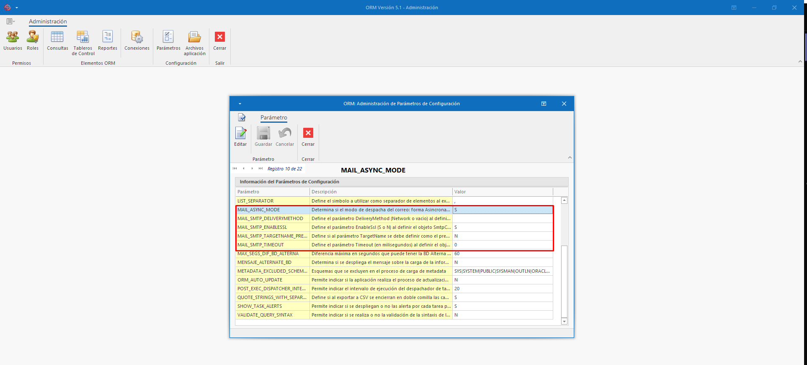
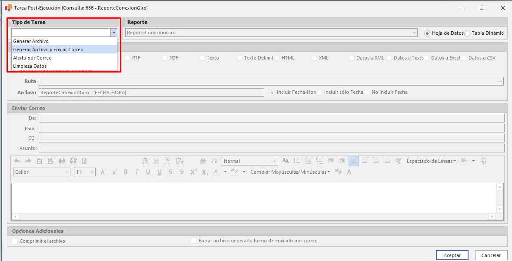
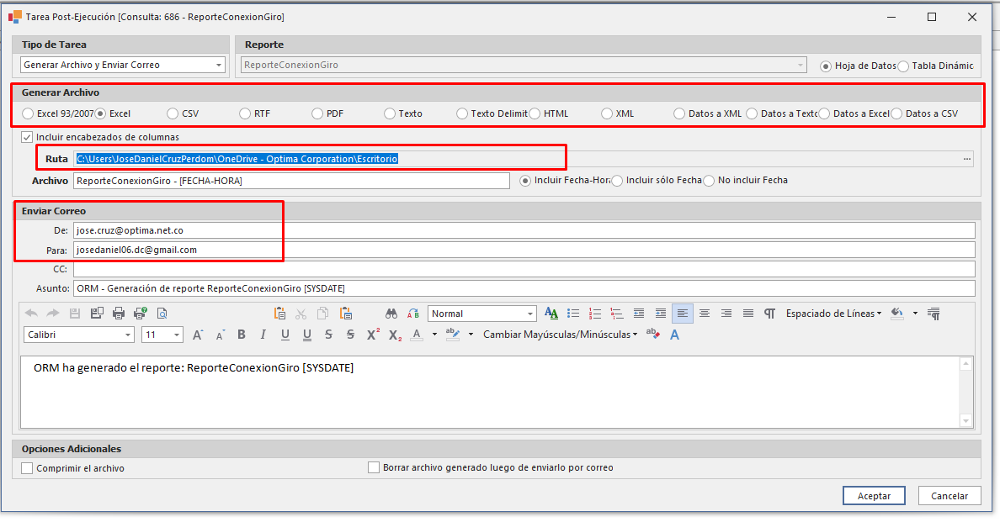

Novedades versión 5.1.0.9
--
**Versión 5.1.0.9**: Se actualiza el despachador de correos SMTP para permitir su configuración mediante parámetros registrados en el panel de administración. Estos parámetros determinan si los correos se envían de forma asíncrona (modo predeterminado y actual) y si se requiere emplear diversos ajustes personalizados según las necesidades del cliente. De este modo, se garantiza una mayor flexibilidad y adaptabilidad del sistema para cumplir con los requisitos específicos.

**Nota:** Se debe tener en cuenta que las contraseñas usadas para los servidores SMTP de **Gmail** y **Office** son contraseñas de aplicaciones, se deben crear directamente en las configuraciones de la cuenta.

Actualización ORM v5.1.0.9
--
Sí actualmente ya cuenta con la versión instalada 5.1.0.8, debe seguir con los siguientes pasos para la actualización.

1. Descargar los siguientes componentes disponibles en el repositorio:
    * ORM.exe
    * Datos.sql

2. Reemplazar archivo ORM.exe en su carpeta instalada ORM.

3. Aplicar los objetos nivel de base de datos sobre el esquema ORM. Verificar su correcta aplicación consultando la tabla OPT_CONFIGURATION:

4. Verificar aplicación de parámetros desde el aplicativo.

    Los parámetros configurados por defecto al ser aplicados vienen configurados de la siguiete manera:
    

Despachando correo
--

Una vez realizado los pasos anteriores debe ir al módulo de **Consultas**  y configurar el servidor SMTP si aún no lo ha programado, primero se debe abrir el despachardor y seleccionar la opción **Configurar servidor SMTP**

Una vez creada la contraseña de aplicaciones según su cliente de correos, se debe confiugrar con las credenciales.

Una vez configuradas dichas credenciales se puede continuar con los siguientes pasos.

1. Levantar el despachador de tareas, es de vital importancia que este se encuentre activo para realizar el despacho de tareas post. Para activalor se debe dar clic en la pestaña superior llamada **Consultas programadas**.

* Se desplegara la siguiente pestaña:

* Se debe abrir una consulta y abrir la pestaña de **Consultas programadas** y se habilitara el botón de **Programar ejecución**.

* Se debe seleccionar la periodicidad de la tarea post

* Luego dar clic en crear nueva tarea

* Seleccionar el tipo de tarea post:

* Para el caso de ejempo se va usar el tipo **Generar archivo y Enviar por correo**.

Se debe seleccionar el tipo de archivo a generar, la ruta en donde se va almacenar y los correos de origen y destino. Dar clic en aceptar.

* Dar clic en **Aceptar** 

* Visualizar la tarea programda desde la pestañana inferior **Ejecuciónes programadas**

